# 从 DeepSeek-V2 到 DeepSeek-V4：架构演进、核心技术与大模型训练范式变化

> 面向 AI 学习者的系统讲解。  
> 依据资料：`DeepSeek_V2_MLA.pdf`、`DeepSeek_V3.pdf`、`DeepSeek_V4.pdf`。  
> 说明：本文严格区分“论文明确内容”和“合理理解”。资料没有明确说明的地方，会标注“资料中未明确说明”。

---

## 一、整体概览

### 1. 三代模型的定位

**DeepSeek-V2：效率架构的奠基版**

V2 的核心目标是：在保持强性能的同时，降低训练成本和推理成本。它提出并验证了两个关键组件：

- **MLA，Multi-head Latent Attention**：压缩 KV Cache，降低推理显存和长上下文成本。
- **DeepSeekMoE**：用稀疏专家结构让模型总参数很大，但每个 token 只激活一小部分参数。

依据：DeepSeek-V2 Abstract、Section 2.1、Section 2.2。

**DeepSeek-V3：规模化训练的工程版**

V3 继承 V2 的 MLA 和 DeepSeekMoE，但重点变成：如何把这套架构稳定扩展到更大规模。V3 的核心升级包括：

- 无辅助损失负载均衡
- Multi-token Prediction
- FP8 混合精度训练
- DualPipe 并行训练系统
- 大规模 MoE 通信优化

依据：DeepSeek-V3 Abstract、Section 2、Section 3、Section 4。

**DeepSeek-V4：百万 token 长上下文版**

V4 的核心目标是突破超长上下文效率瓶颈，支持 1M token context。它引入：

- CSA，Compressed Sparse Attention
- HCA，Heavily Compressed Attention
- mHC，Manifold-Constrained Hyper-Connections
- Muon optimizer
- FP4 Quantization-Aware Training

依据：DeepSeek-V4 Abstract、Section 2、Section 3、Section 4。

### 2. 一张总览图

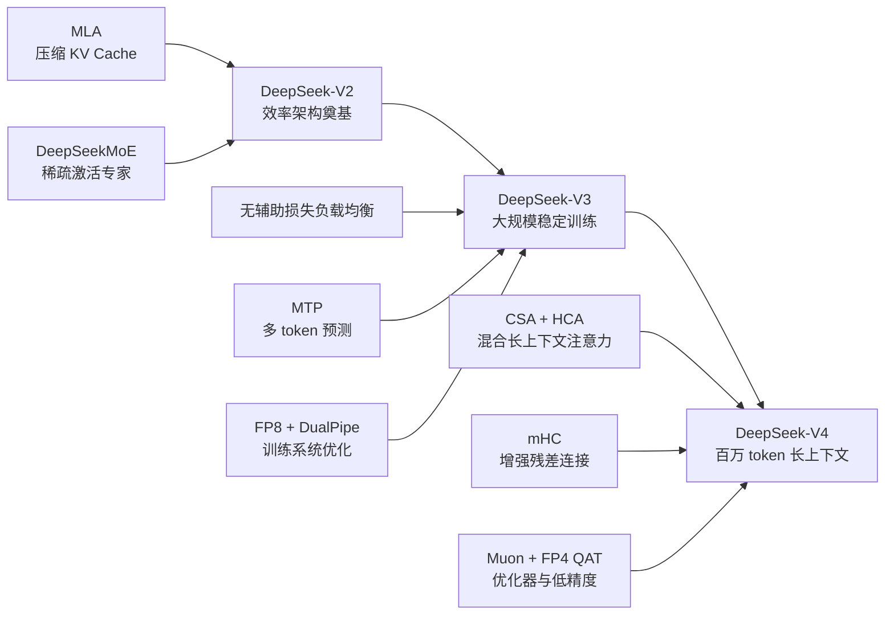

### 3. 核心差异对比表

| 项目 | DeepSeek-V2 | DeepSeek-V3 | DeepSeek-V4 |
|---|---:|---:|---:|
| 总参数 | 236B | 671B | Flash 284B；Pro 1.6T |
| 激活参数 | 21B | 37B | Flash 13B；Pro 49B |
| 训练 tokens | 8.1T | 14.8T | 超过 32T |
| 上下文长度 | 128K | 128K | 1M |
| 注意力机制 | MLA | MLA | CSA + HCA |
| MoE | DeepSeekMoE | DeepSeekMoE + 无辅助损失负载均衡 | 继续 DeepSeekMoE，细节有调整 |
| 训练效率重点 | 稀疏计算、KV 压缩 | FP8、DualPipe、通信优化 | Muon、FP4 QAT、长上下文训练 |
| 推理效率重点 | KV Cache 降低 93.3% | 继续使用 MLA/MoE 优势 | 1M context 下显著降低 FLOPs 和 KV Cache |
| 多模态 | V2 明确当前仅文本 | 资料中未明确说明 | 资料提到未来探索多模态，未说明当前支持 |

依据：V2 Abstract、V3 Abstract、V4 Abstract、V4 Section 4.2.1。

### 4. 参数规模图

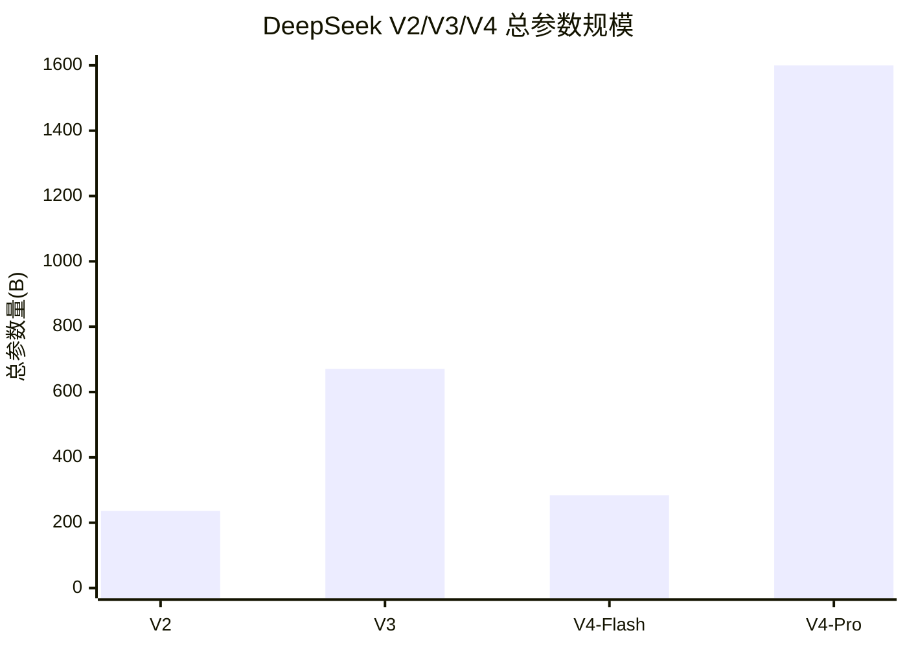

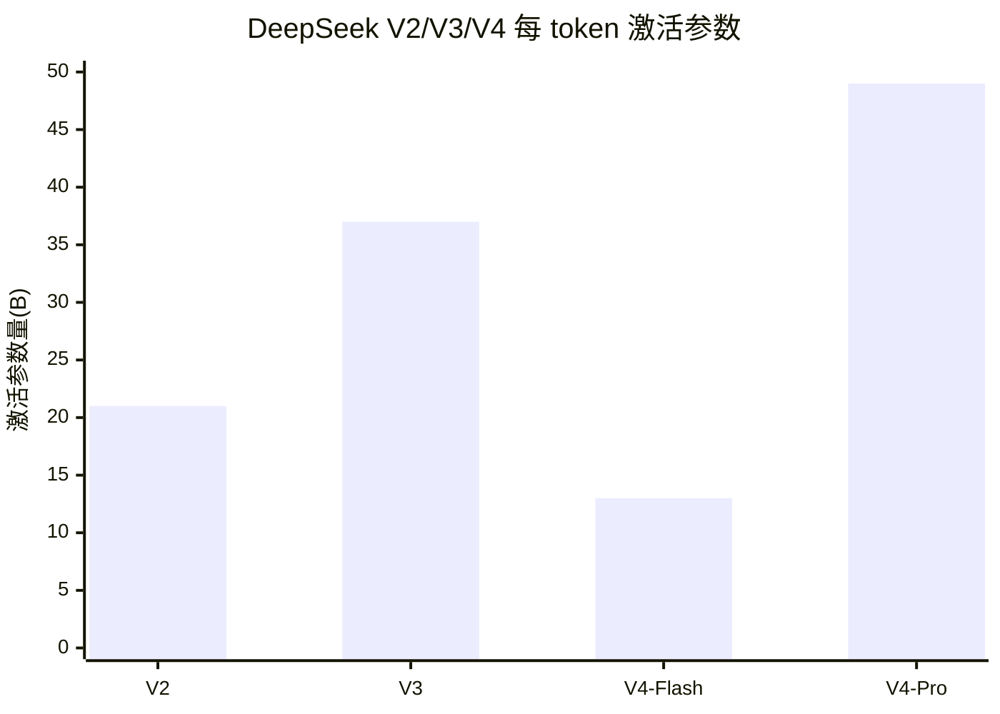

关键理解：

- 总参数代表模型“容量”。
- 激活参数代表每个 token 实际参与计算的规模。
- MoE 的价值在于：总参数可以大，但每次计算不用全部激活。

---

## 二、DeepSeek-V2 详细讲解

### 1. V2 的核心创新

DeepSeek-V2 的核心创新是：

```text
MLA + DeepSeekMoE
```

也就是：

- 用 MLA 降低推理时的 KV Cache。
- 用 DeepSeekMoE 降低每个 token 的计算成本。

依据：DeepSeek-V2 Abstract、Section 2。

### 2. MLA：Multi-head Latent Attention

#### 小白理解

大模型生成文本时，需要记住前面说过的话。这个记忆叫 **KV Cache**。

普通 Attention 像这样：

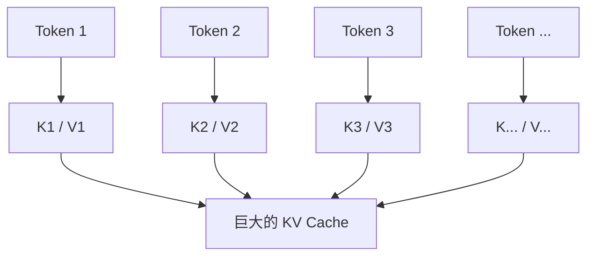

上下文越长，KV Cache 越大，显存越容易爆。

MLA 的做法是先压缩：

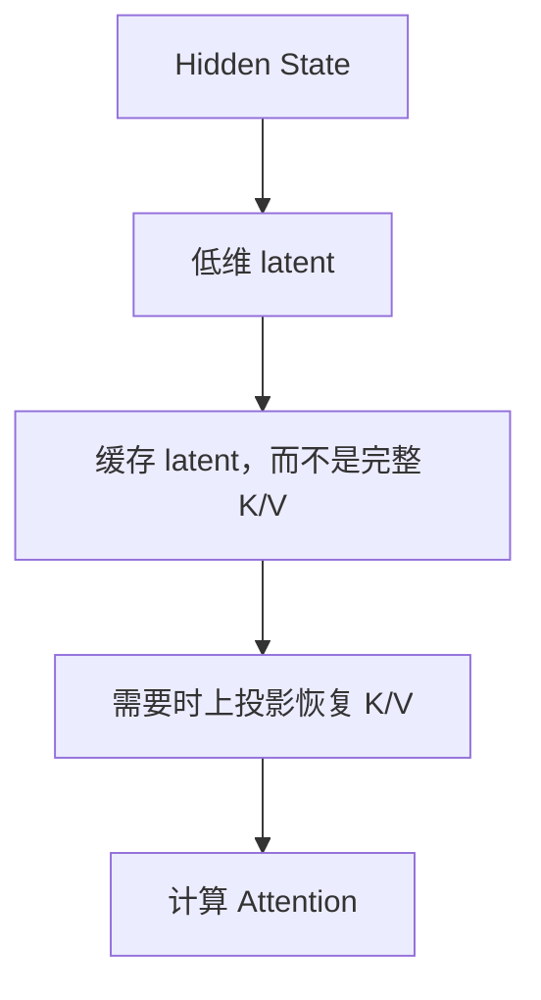

生活化类比：

> 普通 Attention 是把整本书逐页复印并放在桌上。  
> MLA 是先做一套压缩索引卡，需要时再展开相关内容。

#### 技术理解

MLA 对 Key 和 Value 做 **low-rank joint compression**。推理时缓存压缩后的 latent vector，而不是完整 Key 和 Value。

简化伪代码：

```text
h_t = 当前 token 的 hidden state

c_t_KV = W_down_KV * h_t
cache(c_t_KV)

k_t = W_up_K * c_t_KV
v_t = W_up_V * c_t_KV

attention(q_t, k_t, v_t)
```

依据：DeepSeek-V2 Section 2.1.2。

### 3. MLA 与 MHA/MQA/GQA 对比

| 机制 | 核心做法 | 优点 | 局限 |
|---|---|---|---|
| MHA | 每个头有独立 K/V | 表达力强 | KV Cache 大 |
| MQA | 多个 query head 共享一组 K/V | KV Cache 小 | 表达能力可能受限 |
| GQA | 一组 query heads 共享一组 K/V | 折中 | 仍是共享 K/V |
| MLA | K/V 联合压缩为 latent | KV Cache 大幅降低，保留较强表达能力 | 实现复杂 |

依据：DeepSeek-V2 Section 2.1.4。

### 4. DeepSeekMoE 的设计思想

MoE 是 Mixture of Experts，也就是“专家混合模型”。

Dense 模型：


MoE 模型：

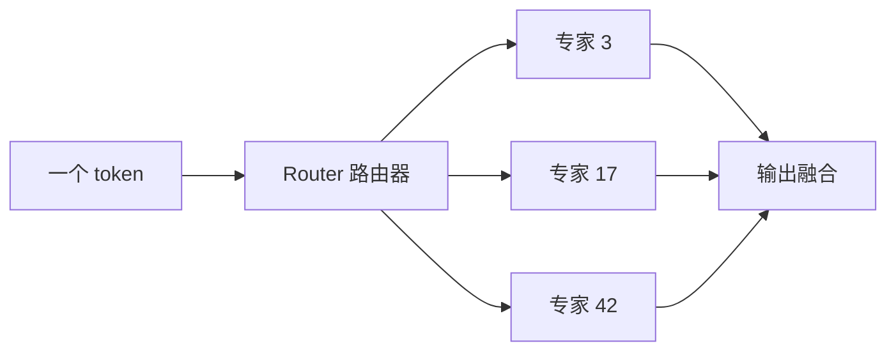

DeepSeekMoE 的关键思想：

- 有共享专家，处理通用能力。
- 有路由专家，处理不同 token 的专门能力。
- 专家更细粒度，利于 specialization。
- 每个 token 只激活少数专家。

V2 中：

- 236B 总参数
- 每 token 激活 21B
- 每个 MoE 层包含 2 个 shared experts 和 160 个 routed experts
- 每个 token 激活 6 个 routed experts

依据：DeepSeek-V2 Section 2.2、Section 3.1.2。

### 5. 为什么 MoE 能降低成本

核心公式：

```text
Dense 计算成本 ≈ 总参数都参与每个 token 计算
MoE 计算成本 ≈ 只计算被选中的专家
```

图示：

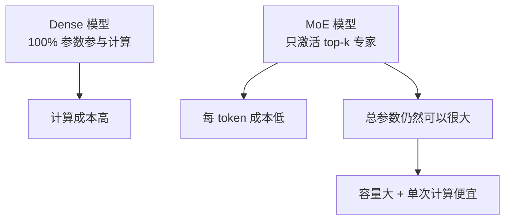

### 6. V2 的收益

V2 相比 DeepSeek 67B：

- 训练成本节省 42.5%
- KV Cache 降低 93.3%
- 最大生成吞吐提升到 5.76 倍
- 支持 128K context
- 236B 总参数，21B 激活参数

依据：DeepSeek-V2 Abstract、Figure 1。

### 7. V2 架构类比

DeepSeek-V2 像一个大型咨询公司：

- MLA 是资料压缩索引系统。
- MoE 是专家会诊系统。
- Router 是项目经理，决定每个问题找哪些专家。
- KV Cache 是提前整理好的工作笔记。

---

## 三、DeepSeek-V3 详细讲解

### 1. V3 相比 V2 改进在哪里

V3 的主线不是重新发明架构，而是把 V2 的架构规模化。

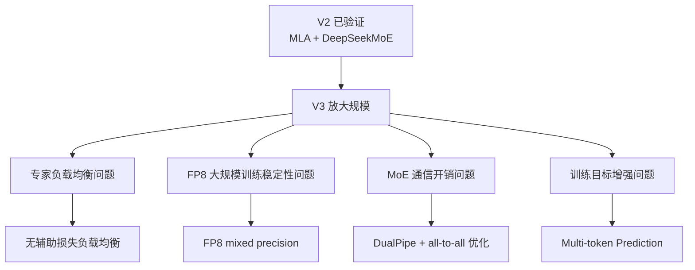

依据：DeepSeek-V3 Abstract、Section 2、Section 3。

### 2. Multi-token Prediction

普通语言模型训练：


V3 的 MTP：

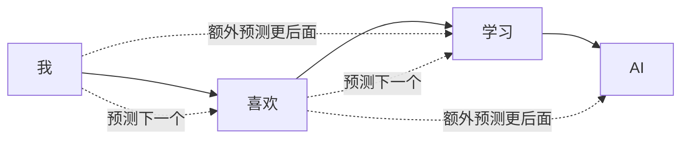

通俗解释：

> 普通模型是“走一步看一步”。  
> MTP 是“走一步时，也训练模型看后两步”。

V3 中 MTP depth 设置为 1。  
依据：DeepSeek-V3 Section 2.2、Section 4.2。

### 3. 无辅助损失负载均衡

MoE 的问题是专家可能冷热不均：

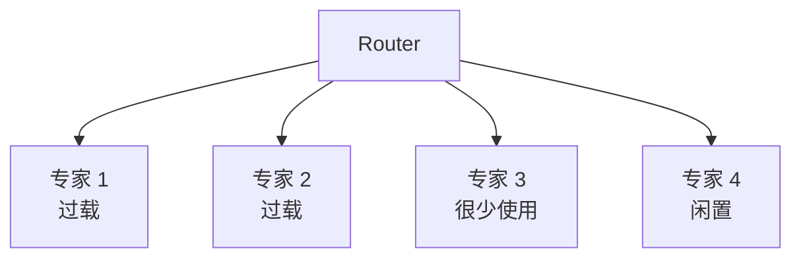

V2 的做法：使用辅助 loss 促进均衡。  
V3 的做法：使用 **auxiliary-loss-free load balancing**，通过动态 bias 调节专家被选中的概率。

图示：


通俗解释：

> V2 像给路由器加一门“专家平均使用率”的考试。  
> V3 像实时观察专家忙闲，然后动态调节派单概率。

依据：DeepSeek-V3 Section 2.1.2、Section 4.5.2。

### 4. V3 如何提高训练效率和推理效率

训练效率：

- FP8 mixed precision training
- DualPipe pipeline parallelism
- 计算与通信重叠
- all-to-all 通信优化
- activation recomputation 和低精度存储

推理效率：

- 继续使用 MLA 降低 KV Cache。
- 继续使用 MoE 降低每 token 激活计算。
- 推理部署中区分 prefill 和 decoding 优化。

依据：DeepSeek-V3 Section 3.2、Section 3.3、Section 3.4。

### 5. V3 工程问题与解决方案

| 工程问题 | 为什么困难 | V3 方案 |
|---|---|---|
| MoE all-to-all 通信重 | 专家分布在不同设备，token 要跨设备分发 | 高效 all-to-all + DualPipe |
| Pipeline bubble | 多流水线阶段会互相等待 | DualPipe 降低 bubble |
| FP8 精度风险 | 低精度容易带来误差和不稳定 | 细粒度量化、关键算子保持高精度 |
| 激活显存压力 | 671B 模型训练中 activation 很大 | activation recomputation、低精度缓存 |
| 专家负载不均 | 少数专家过载，影响吞吐和稳定性 | 无辅助损失负载均衡 |

### 6. V3 关键升级表

| 技术 | V2 情况 | V3 升级 | 作用 |
|---|---|---|---|
| MLA | 已使用 | 继续使用 | 保持 KV Cache 优势 |
| DeepSeekMoE | 已使用 | 规模更大，路由更优化 | 提升容量与效率 |
| Load Balance | 辅助损失 | 无辅助损失策略 | 减少辅助 loss 干扰 |
| Training Objective | next-token | MTP | 增强训练信号 |
| Precision | 资料重点不在 FP8 | FP8 mixed precision | 降低训练成本 |
| Parallelism | 常规优化 | DualPipe | 提升训练吞吐 |

---

## 四、DeepSeek-V4 详细讲解

### 1. V4 的目标定位

V4 的目标是：支持百万 token 上下文，并在长上下文、推理、代码、数学和 agent 任务上提升能力。

依据：DeepSeek-V4 Abstract、Section 1、Section 5。

### 2. V4 相比 V3 的架构变化

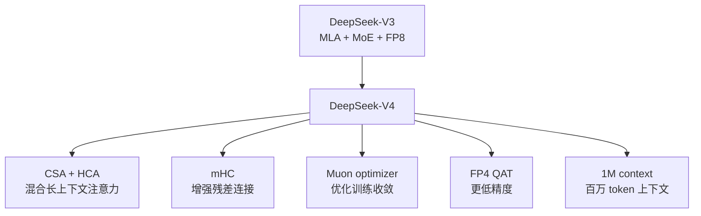

依据：DeepSeek-V4 Abstract、Section 2。

### 3. CSA + HCA：为什么需要新注意力

128K context 时，MLA 压缩 KV Cache 很有效。  
1M context 时，问题不仅是缓存大，还包括：

- 注意力计算 FLOPs 高
- 远距离信息检索困难
- 长程 agent/reasoning 需要保留更多历史

V4 的混合策略：

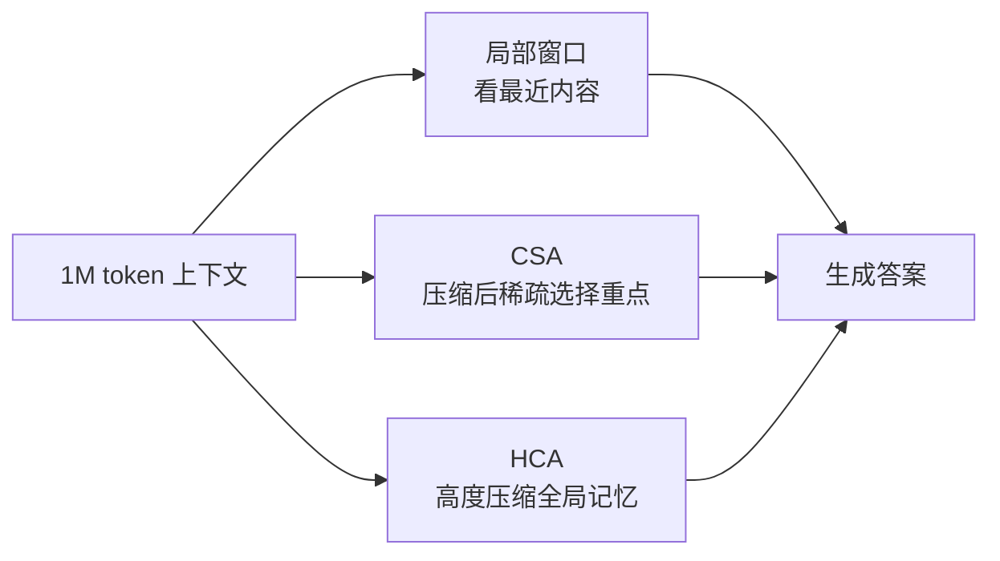

通俗解释：

> 不是把整座图书馆逐页读完，  
> 而是最近内容细读，远处内容检索，全局内容压缩成摘要。

依据：DeepSeek-V4 Section 2.3。

### 4. V4 是否继续使用 MLA、MoE、MTP

严格按资料：

| 机制 | V4 是否使用 | 说明 |
|---|---|---|
| MLA | 资料中未明确说明继续作为主注意力 | V4 明确采用 CSA + HCA |
| DeepSeekMoE | 使用 | V4 继承 DeepSeekMoE，做 minor adjustments |
| MTP | 使用 | V4 Flash/Pro 的 MTP depth 为 1 |
| FP8 | 部分复用 | FP4 QAT 管线复用已有 FP8 框架 |
| FP4 | 使用 | MoE experts 和部分 attention 计算中使用 |

依据：DeepSeek-V4 Section 2.1、Section 2.3、Section 3.4、Section 4.2.1。

### 5. V4 的推理、长上下文、代码、数学、Agent 能力

论文明确提到 V4 在以下方面评测或提升：

- Knowledge
- Reasoning
- Coding
- Mathematics
- Long context
- Agentic tasks

特别是：

- 支持 1M context。
- V4-Pro-Max 是最大 reasoning effort mode。
- 引入 `|DSML|` token 和 XML-based tool-call schema。
- 对 tool-calling 场景支持 interleaved thinking。

依据：DeepSeek-V4 Section 5.1、Section 5.3。

多模态：

- V2 明确说当前仅支持 text modality。
- V4 结论中说未来会探索 multimodal capabilities。
- 资料中未明确说明 V4 当前支持多模态。

依据：DeepSeek-V2 Section 6、DeepSeek-V4 Section 6。

### 6. V4 的效率收益

V4 论文中明确说，在 1M-token context 场景：

- DeepSeek-V4-Pro 相比 DeepSeek-V3.2：single-token inference FLOPs 为 27%，KV Cache 为 10%。
- DeepSeek-V4-Flash 相比 DeepSeek-V3.2：single-token inference FLOPs 为 10%，KV Cache 为 7%。

依据：DeepSeek-V4 Abstract、Section 1。

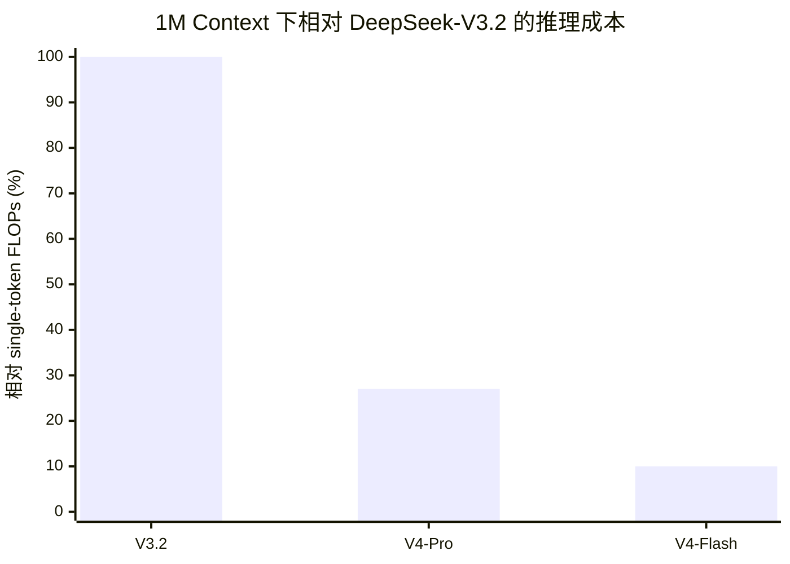

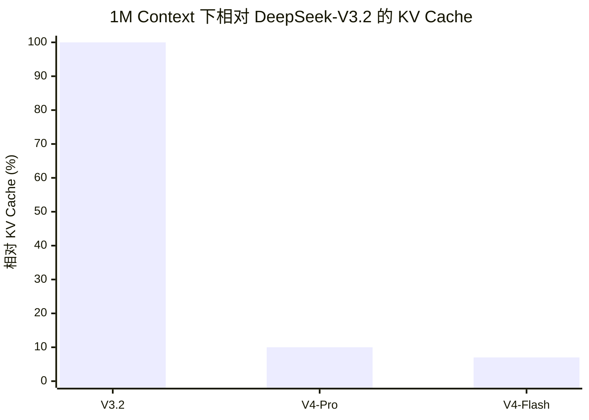

注意：你目录中没有 DeepSeek-V3.2 论文，因此 V3.2 的具体架构细节不展开。

---

## 五、核心技术专题讲解

### 1. Transformer 注意力机制

**小白版**

注意力机制像查资料。模型生成当前词时，会回头看前文哪些词最重要。

**技术版**

给定 Query、Key、Value，用 Query 和 Key 的相似度决定从 Value 中取多少信息。

**公式版**

```text
Attention(Q, K, V) = softmax(QK^T / sqrt(d)) V
```

依据：DeepSeek-V2 Section 2.1.1。

### 2. Multi-head Attention

**小白版**

多个研究员从不同角度查同一份资料。

**技术版**

把 Q/K/V 分成多个 head，每个 head 学不同关系，最后拼接输出。

**公式版**

```text
head_i = Attention(Q_i, K_i, V_i)
output = concat(head_1, ..., head_h) W_o
```

### 3. MQA / GQA

**小白版**

为了节省笔记，不是每个研究员都保存一份完整资料，而是共享部分资料。

**技术版**

- MQA：所有 query heads 共享一组 K/V。
- GQA：一组 query heads 共享一组 K/V。

**伪代码版**

```text
for query_head in query_heads:
    kv = shared_kv_group(query_head)
    output = attention(query_head, kv)
```

依据：DeepSeek-V2 Section 2.1.4。

### 4. MLA

**小白版**

MLA 像压缩索引。不是保存完整笔记，而是保存一张压缩卡片。

**技术版**

MLA 使用 low-rank key-value joint compression，推理时缓存 latent vector。

**伪代码版**

```text
c_kv = W_down_kv * h
cache(c_kv)

k = W_up_k * c_kv
v = W_up_v * c_kv

out = attention(q, k, v)
```

依据：DeepSeek-V2 Section 2.1.2。

### 5. MoE

**小白版**

MoE 像专家会诊，每个问题只找相关专家。

**技术版**

Router 为每个 token 选择 top-k experts，只激活部分 FFN。

**伪代码版**

```text
scores = router(x)
selected = top_k(scores)
output = sum(score_i * expert_i(x) for expert_i in selected)
```

### 6. DeepSeekMoE

**小白版**

DeepSeekMoE 是更精细的专家团队，有通用专家，也有专门专家。

**技术版**

使用 shared experts + routed experts，并采用 fine-grained expert segmentation。

**伪代码版**

```text
shared = shared_experts(x)
routed = top_k_routed_experts(x)
output = shared + routed
```

依据：DeepSeek-V2 Section 2.2、DeepSeek-V3 Section 2.1.2。

### 7. Expert Routing

**小白版**

路由器像分诊台，决定这个 token 应该找哪些专家。

**技术版**

Router 根据 hidden state 计算 token-to-expert affinity，然后选择 top-k experts。

**伪代码版**

```text
score_i = router_i(x)
experts = top_k(score_i)
```

### 8. Load Balance

**小白版**

不能让少数专家忙死，其他专家闲着。

**技术版**

MoE 需要平衡专家负载，否则会导致通信瓶颈和训练不稳定。V2 使用辅助损失，V3 使用无辅助损失负载均衡。

**伪代码版**

```text
for expert in experts:
    if load(expert) > target:
        routing_bias[expert] -= delta
    else:
        routing_bias[expert] += delta
```

依据：DeepSeek-V2 Section 2.2.3、DeepSeek-V3 Section 2.1.2。

### 9. Multi-token Prediction

**小白版**

不只预测下一个词，还顺便预测更后面的词。

**技术版**

在 next-token objective 之外增加额外预测目标，让 hidden state 更有前瞻性。

**伪代码版**

```text
loss = CE(pred_t_plus_1, token_t_plus_1)
loss += CE(pred_t_plus_2, token_t_plus_2)
```

依据：DeepSeek-V3 Section 2.2。

### 10. KV Cache 压缩与推理加速

**小白版**

KV Cache 像提前整理好的笔记。笔记越小，翻得越快，占空间越少。

**技术版**

自回归生成中，每步都要访问历史 K/V。压缩 KV Cache 可以降低显存占用和 memory bandwidth 压力。

**伪代码版**

```text
for new_token:
    q = compute_query(new_token)
    kv = read_cache()
    out = attention(q, kv)
    append_compressed_kv(new_token)
```

### 11. 训练成本、推理成本、显存占用之间的关系

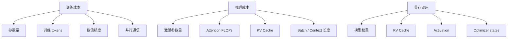

DeepSeek 的路线：

```text
MoE -> 降每 token 计算
MLA -> 降 KV Cache
FP8/FP4 -> 降数值计算和存储成本
CSA/HCA -> 降长上下文 attention 成本
DualPipe -> 降训练通信等待
```

---

## 六、从 V2 到 V4 的演进逻辑

### 1. 问题-解决方案-效果总表

| 版本 | 面临的问题 | 解决方案 | 效果 |
|---|---|---|---|
| V2 | Dense 模型训练贵；KV Cache 大；推理吞吐受限 | MLA + DeepSeekMoE | 训练成本下降，KV Cache 大幅下降，吞吐提升 |
| V3 | 架构要扩到 671B；MoE 通信和负载难；低精度训练难 | 无辅助损失负载均衡、MTP、FP8、DualPipe | 大规模 MoE 稳定训练 |
| V4 | 128K 不够；1M context 下 attention 和 KV Cache 成本过高 | CSA/HCA、mHC、Muon、FP4 QAT | 支持 1M context，长上下文推理成本下降 |

### 2. 演进路径图

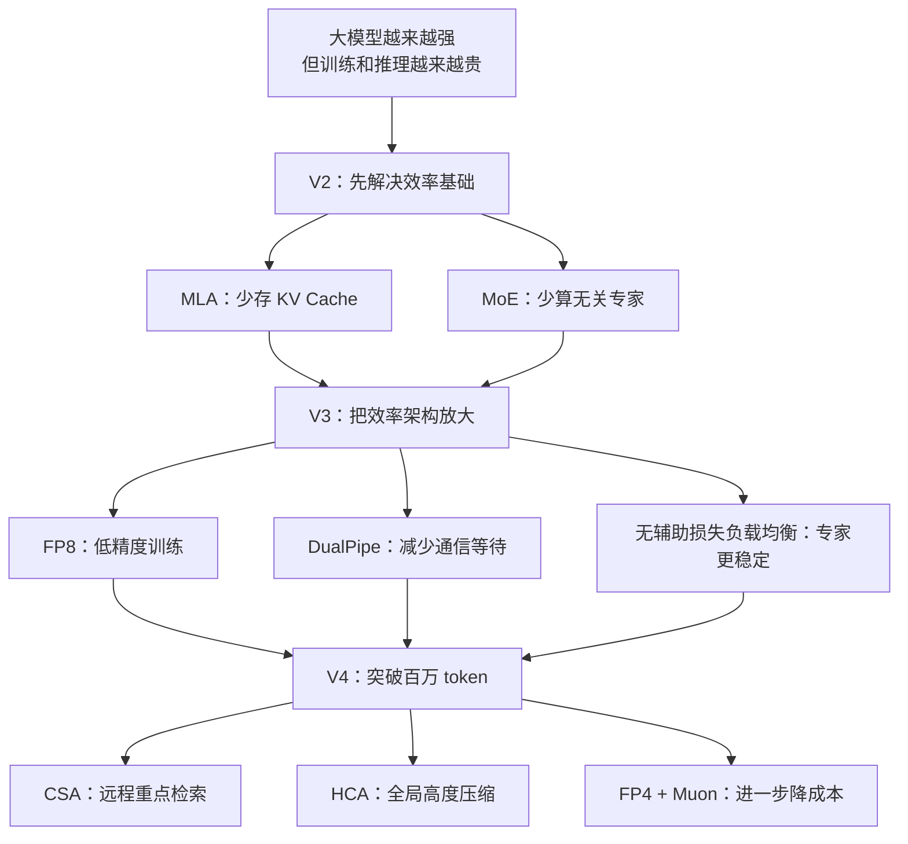

### 3. 发展方向

这些变化说明，大模型正在从：

```text
单纯堆参数
```

走向：

```text
架构效率 + 稀疏计算 + 低精度训练 + 长上下文系统 + Agent 化推理
```

### 4. 为什么 DeepSeek 强调低成本、高效率和开源生态

论文明确强调：

- economical training
- efficient inference
- open checkpoints

合理理解：

低成本让大模型更容易训练和部署；高效率让长上下文、agent 和推理模型更可用；开源 checkpoints 让社区可以复现、部署和继续改进。

依据：DeepSeek-V2 Abstract、DeepSeek-V3 Abstract、DeepSeek-V4 Abstract。

---

## 七、适合做成 AI 讲解视频的 10 分钟讲稿

大家好，今天我们用 10 分钟讲清楚 DeepSeek 从 V2 到 V4 到底进化了什么。

很多人看大模型论文，会被参数量、benchmark、各种缩写搞晕。但 DeepSeek 这条线其实有一个非常清楚的主线：让模型越来越强，同时越来越省。

先看 V2。

DeepSeek-V2 的核心可以用一句话概括：它发明了一套更省钱的大模型结构。

大模型生成文字时，会把前文整理成 KV Cache。你可以把 KV Cache 想成模型提前做好的笔记。问题是，上下文越长，笔记越厚，显存就越爆。

V2 的 MLA 就像“压缩索引”。它不把完整笔记都存下来，而是把 Key 和 Value 压缩成一个 latent 表示。需要用的时候，再把它展开。这样 KV Cache 大幅变小。论文中说，相比 DeepSeek 67B，KV Cache 降低了 93.3%。

V2 的第二个核心是 MoE，也就是专家混合模型。它像专家会诊。医院里有很多专家，但不是每个病人都要所有专家一起看。每个 token 进来，路由器只选择少数几个专家处理。

所以 V2 有 236B 总参数，但每个 token 只激活 21B。

V2 的一句话总结：用 MLA 省显存，用 MoE 省计算。

接着看 V3。

DeepSeek-V3 不是推翻 V2，而是把 V2 的路线做大。V3 有 671B 总参数，每个 token 激活 37B，训练了 14.8T tokens。

但模型一大，问题就来了：专家会不会冷热不均？GPU 通信会不会很慢？低精度训练会不会不稳定？

V3 的答案有几个。

第一，MoE 负载均衡。V2 依赖辅助 loss 来让专家平均工作。V3 改成无辅助损失负载均衡，更像根据专家忙闲程度动态调节路由概率。

第二，Multi-token Prediction。普通模型是“走一步看一步”，只预测下一个 token。V3 让模型多预测后面的 token，让模型更有前瞻性。

第三，FP8 训练。可以理解成用更轻的数字格式运输货物，降低计算和显存成本。

第四，DualPipe。它让 GPU 计算和通信更好重叠，减少等待。

V3 的一句话总结：V3 把 V2 的省钱结构，扩展成可以稳定训练的超大 MoE 系统。

最后看 V4。

V4 的目标变了：它要处理百万 token 上下文。

128K 上下文时，MLA 压缩 KV Cache 很重要。但到了 1M token，问题不仅是“笔记太厚”，而是“书架太大，你不能每次都把整座图书馆翻一遍”。

所以 V4 引入 CSA 和 HCA。

CSA 像搜索引擎：从百万 token 里挑重点片段看。

HCA 像全书摘要：把超长上下文压缩成长期记忆。

再加上局部窗口 attention，负责看最近内容。

所以 V4 的策略是：近处细看，远处检索，全局压缩。

V4 还有 mHC，增强信息在网络层之间流动；Muon 优化器，提高训练稳定性；FP4 QAT，把低精度进一步推到 FP4。

V4 的一句话总结：V4 把 DeepSeek 从长上下文模型，推进到百万 token 上下文系统。

总结一下：

DeepSeek-V2 解决“怎么省显存、省计算”。  
DeepSeek-V3 解决“怎么把这套架构稳定放大”。  
DeepSeek-V4 解决“怎么让模型真正处理百万 token 的长程任务”。

这条路线说明，大模型竞争不只是参数量竞争，而是系统效率竞争：谁能用更低成本训练、更低成本推理、更长上下文、更强工具调用能力，谁就更接近下一代 AI 基础设施。

---

## 八、资料边界与冲突点

### 1. 资料中未明确说明的内容

| 内容 | 说明 |
|---|---|
| V3 是否支持多模态 | 资料中未明确说明 |
| V4 当前是否支持多模态 | 资料中未明确说明；V4 仅提到未来探索多模态 |
| V4 是否继续以 MLA 为主注意力 | 资料中未明确说明；V4 明确采用 CSA/HCA |
| DeepSeek-V3.2 的完整架构细节 | 当前目录没有 V3.2 论文 |

### 2. 可能的冲突或注意事项

| 点 | 说明 |
|---|---|
| V4 与 V3.2 对比 | V4 论文大量对比 DeepSeek-V3.2，但当前资料目录没有 V3.2 原文 |
| V4 benchmark | 多处为内部评测框架，需要按论文报告理解，不等同第三方独立验证 |
| 多模态 | V2 明确当前仅文本；V4 只说未来探索多模态 |

---

## 九、关键术语速查表

| 术语 | 中文解释 | 一句话理解 |
|---|---|---|
| Attention | 注意力机制 | 当前 token 回头查哪些历史信息最重要 |
| MHA | 多头注意力 | 多个角度同时看上下文 |
| MQA | 多查询注意力 | 多个 query 头共享一组 K/V |
| GQA | 分组查询注意力 | 一组 query 头共享一组 K/V |
| MLA | 多头潜在注意力 | 把 K/V 压缩成 latent 来省 KV Cache |
| KV Cache | Key/Value 缓存 | 生成时提前整理好的历史笔记 |
| MoE | 专家混合模型 | 每个 token 只找部分专家 |
| DeepSeekMoE | DeepSeek 的 MoE 架构 | 共享专家 + 路由专家 + 细粒度专家 |
| Expert Routing | 专家路由 | 决定 token 该找哪些专家 |
| Load Balance | 负载均衡 | 避免少数专家过载 |
| MTP | 多 token 预测 | 不只预测下一个 token |
| FP8 | 8-bit 浮点 | 更低精度训练，省算力和显存 |
| FP4 QAT | FP4 量化感知训练 | 训练时适应更低精度 |
| DualPipe | 双向流水线并行 | 减少训练通信等待 |
| CSA | 压缩稀疏注意力 | 在长上下文中挑重点看 |
| HCA | 高度压缩注意力 | 把长上下文压成全局记忆 |
| mHC | 流形约束超连接 | 增强层间信息流动 |
| Muon | 优化器 | V4 用于多数参数的优化器 |
| Reasoning Effort | 推理努力程度 | 控制思考预算和上下文预算 |

---

## 十、适合初学者的学习路线

### 1. 推荐学习顺序

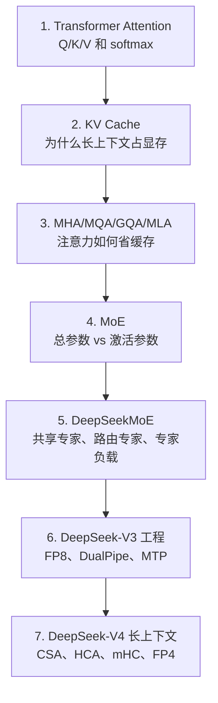

### 2. 推荐阅读路径

```text
DeepSeek-V2 Abstract
-> V2 Section 2.1 MLA
-> V2 Section 2.2 DeepSeekMoE
-> DeepSeek-V3 Abstract
-> V3 Section 2 Architecture
-> V3 Section 3 Infrastructure
-> DeepSeek-V4 Abstract
-> V4 Section 2 Architecture
-> V4 Section 4 Pre-Training
-> V4 Section 5 Post-Training and Evaluation
```

### 3. 最小理解闭环

如果时间有限，只需要先理解这三句话：

1. **V2：MLA 少存，MoE 少算。**
2. **V3：把 V2 的架构稳定放大，并用 FP8/DualPipe 训得起。**
3. **V4：用 CSA/HCA 把长上下文从 128K 推到 1M。**

---

## 十一、最终总结

DeepSeek-V2 到 V4 的演进，不是简单堆参数，而是一条非常清晰的系统效率路线：

```text
V2：效率架构创新
V3：大规模训练工程化
V4：百万 token 长上下文系统化
```

这条路线说明，下一阶段大模型竞争的核心不只是“谁更大”，而是：

- 谁能更省地训练
- 谁能更便宜地推理
- 谁能处理更长上下文
- 谁能更稳定地做复杂推理和 agent 任务
- 谁能把架构、训练、推理、系统工程协同设计

DeepSeek 系列的价值，正在于它把这些问题放在同一条技术主线上持续推进。
