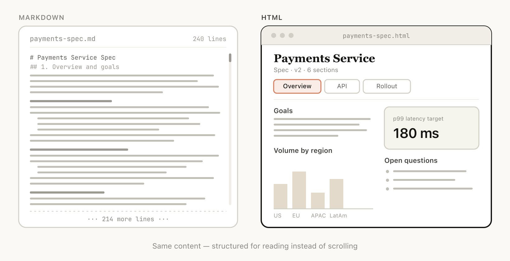
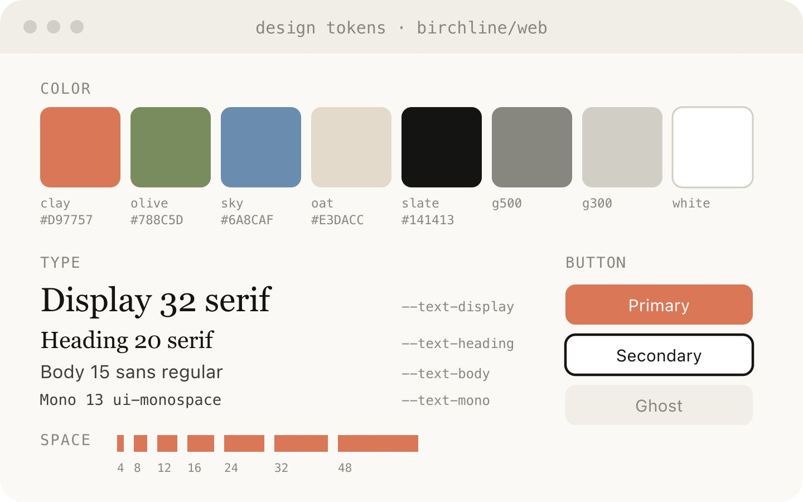
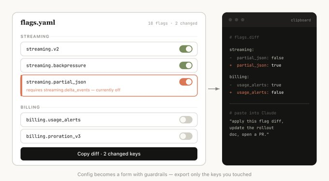

# Using Claude Code：HTML 的不合理有效性

> 原文：[[Using Claude Code: The Unreasonable Effectiveness of HTML]]  
> 来源：[X / Thariq](https://x.com/trq212/status/2052809885763747935?s=46)  
> 示例集：https://thariqs.github.io/html-effectiveness/


*封面：作者把 HTML 作为 Claude Code 的新输出界面。*

## 一句话总结

作者认为：随着 Claude Code 等 Agent 能力变强，**Markdown 已经开始限制 Agent 与人沟通复杂信息的效率**；相比之下，HTML 更适合作为规格说明、研究报告、代码审查、设计原型和交互式编辑界面的输出格式。

## 核心观点

### 1. Markdown 的优势正在变弱

Markdown 简单、便携、容易编辑，曾经非常适合人和 Agent 之间传递信息。但作者发现：

- 超过 100 行的 Markdown 很难认真读完。
- 复杂计划、规格说明、代码审查用纯文本表达不够直观。
- 现在很多文件并不是人手动编辑，而是作为 spec、reference、brainstorming output 给 Claude 继续处理。
- 如果修改也主要通过提示 Claude 来完成，那么 Markdown “容易手动编辑”的优势就没那么重要了。


*Markdown 中表达颜色/设计信息往往很别扭，甚至会退化成用字符模拟色块。*

### 2. HTML 的信息密度更高

HTML 不只是网页，它可以作为一个更丰富的信息容器：

| 表达对象 | HTML 能力 |
|---|---|
| 文档结构 | 标题、段落、列表、链接 |
| 表格数据 | `<table>` |
| 设计信息 | CSS、颜色、排版、响应式布局 |
| 图示 | SVG、Canvas、绝对定位 |
| 代码 | 代码块、语法高亮、注释 |
| 交互 | JavaScript、滑块、按钮、Tab、拖拽 |
| 图片和媒体 | `` 等 |
| 工作流 | 流程图、状态图、卡片布局 |

作者的判断是：**几乎任何 Claude 能读取的信息，都能相当高效地用 HTML 表达出来。**


*HTML 可以承载表格、设计、SVG、代码、交互、工作流、空间布局和图片等多种信息。*

### 3. HTML 更容易被人读完和分享

Claude Code 能做的事情越复杂，生成的计划和说明就越长。作者发现：

- 长 Markdown 很少有人愿意读。
- HTML 可以用视觉层级、Tab、插图、链接、响应式布局降低阅读负担。
- HTML 文件上传到 S3 或静态站点后，分享一个链接即可。
- 同事阅读 spec、报告、PR 说明的概率会更高。


*同样的内容，HTML 可以组织成更适合阅读的结构，而不是让人滚动浏览长 Markdown。*

### 4. HTML 支持“双向交互”

HTML 不只是展示结果，还能让人参与调整：

- 用滑块调动画参数。
- 用旋钮调设计选项。
- 拖拽卡片重新排序任务。
- 在编辑器里调 prompt/template，并实时预览。
- 最后通过 “copy as JSON / copy as prompt / copy diff” 把人的修改再反馈给 Claude Code。

这让 HTML 成为一种 **人类意图 → 可视化编辑 → 结构化反馈给 Agent** 的中间层。


*在浏览器中调参，再把结果复制为 prompt 交还给 Agent。*

### 5. 为什么用 Claude Code 生成 HTML，而不是普通 Claude？

作者强调 Claude Code 的优势在于上下文摄取能力：

- 可以读取本地代码目录。
- 可以读取已有 HTML 文件并归类总结。
- 可以结合 MCP：Slack、Linear 等。
- 可以结合浏览器、Git 历史、代码库等上下文。

因此 Claude Code 生成的 HTML 不只是“好看页面”，而是基于项目真实上下文的可视化产物。

## 典型使用场景

### A. Specs、Planning、Exploration

用 HTML 做复杂问题探索，而不是只写一个 Markdown plan。


*用 HTML 并排展示多个方案，让人直接比较 tradeoff。*

适合：

- 比较多个实现方向。
- 比较多个视觉设计方案。
- 展示数据流、mockup、关键代码片段。
- 先生成一组探索文件，再让新的 Claude Code session 基于这些文件实现。

示例 Prompt：

```text
I'm not sure what direction to take the onboarding screen.
Generate 6 distinctly different approaches — vary layout, tone, and density —
and lay them out as a single HTML file in a grid so I can compare them side by side.
Label each with the tradeoff it's making.
```

```text
Create a thorough implementation plan in a HTML file,
be sure to make some mockups, show data flow and add important code snippets I might want to review.
Make it easy to read and digest.
```

### B. Code Review & Understanding

HTML 比 Markdown 更适合展示复杂代码差异、注释、流程图和模块关系。


*HTML 版 PR explainer 可以把 diff、风险等级和旁注放在一个可读界面里。*

作者甚至说：他现在每个 PR 都会附一个 HTML code explainer。

示例 Prompt：

```text
Help me review this PR by creating an HTML artifact that describes it.
I'm not very familiar with the streaming/backpressure logic so focus on that.
Render the actual diff with inline margin annotations,
color-code findings by severity and whatever else might be needed to convey the concept well.
```

适合：

- 创建 PR 说明。
- 审查 PR。
- 理解复杂代码主题。
- 替代默认 GitHub diff 的一部分阅读体验。

### C. Design & Prototypes

HTML 对设计表达非常强，即使最终产物不是网页，也可以先用 HTML 原型探索。


*让 Claude 从代码库中提炼设计 token，形成后续 HTML artifact 的风格参考。*

示例 Prompt：

```text
I want to prototype a new checkout button,
when clicked it does a play animation and then turns purple quickly.
Create a HTML file with several sliders and options for me to try different options on this animation,
give me a copy button to copy the parameters that worked well.
```

适合：

- 设计系统 artifact。
- 组件调整。
- 组件库可视化。
- 微交互和动画原型。

### D. Reports、Research & Learning

Claude Code 可以跨数据源综合信息，再生成可读性很强的 HTML 报告。


*技术解释页面：上方流程图、中间代码片段和解释、底部 gotchas。*

适合：

- 解释某个功能如何工作。
- 生成技术概念 explainer。
- 给老板的周报。
- 事故报告。
- SVG 技术图、流程图、架构图。

示例 Prompt：

```text
I don't understand how our rate limiter actually works.
Read the relevant code and produce a single HTML explainer page:
a diagram of the token-bucket flow,
the 3–4 key code snippets annotated,
and a "gotchas" section at the bottom.
Optimize it for someone reading it once.
```

### E. Custom Editing Interfaces

当纯文本很难表达你的调整意图时，可以让 Claude Code 生成一次性的 HTML 编辑器。


*把配置文件变成带约束的表单，只导出被修改的 diff。*

关键点：**最后一定要有导出按钮**，把人的操作转成 Claude Code 能继续使用的格式。

示例：

```text
I need to reprioritize these 30 Linear tickets.
Make me an HTML file with each ticket as a draggable card across Now / Next / Later / Cut columns.
Pre-sort them by your best guess.
Add a "copy as markdown" button that exports the final ordering with a one-line rationale per bucket.
```

```text
Here's our feature flag config.
Build a form-based editor for it,
group flags by area,
show dependencies between them,
warn me if I enable a flag whose prerequisite is off.
Add a "copy diff" button that gives me just the changed keys.
```

```text
I'm tuning this system prompt.
Make a side-by-side editor:
editable prompt on the left with the variable slots highlighted,
three sample inputs on the right that re-render the filled template live.
Add a character/token counter and a copy button.
```

适合：

- 任务、ticket、反馈的排序和分桶。
- 编辑结构化配置：feature flags、env vars、JSON/YAML。
- 调 prompt、模板、文案，并实时预览。
- 数据集标注、approve/reject、tag examples。
- 对文档、转录、diff 做注释并导出。
- 选择难以用文本表达的值：颜色、动画曲线、裁剪区域、cron、regex。

## 常见问题

### HTML 是否更耗 token？

是的，Markdown 通常更省 token。作者认为 HTML 的表达力和更高的阅读概率，抵消了 token 增加的问题。尤其在大上下文窗口里，这个问题不明显。

### HTML 生成是否更慢？

是的，可能比 Markdown 慢 2～4 倍。但作者认为结果值得。

### HTML 如何查看？

本地浏览器打开即可；如果要分享，可以上传到 S3 或静态站点。

### 版本控制怎么办？

这是 HTML 的主要缺点之一：HTML diff 噪音大，比 Markdown 难 review。

### 如何让 Claude 生成不丑的 HTML？

可以让 Claude 读取项目代码库，生成一个设计系统 HTML 文件，之后把它作为风格参考。

## 我的理解

这篇文章不是简单地说“HTML 比 Markdown 好”，而是在说：

> 当 Agent 从“写几段文字”进化到“设计、规划、审查、解释复杂系统”时，输出格式也应该从线性文本升级为可视化、可交互、可分享的工作界面。

可以把它理解为：

```text
Markdown = Agent 的笔记纸
HTML = Agent 的临时工作台 / 仪表盘 / 可交互说明书
```

对 Claude Code / Codex / Hermes 这类 Agent 来说，HTML 很适合承担一种中间层角色：

1. Agent 读取代码、历史、任务系统、知识库。
2. Agent 生成一个 HTML artifact。
3. 人通过页面理解、比较、调整。
4. 页面导出 JSON / Markdown / Prompt / Diff。
5. Agent 继续执行。

## 可复用工作流

### 工作流 1：复杂任务先生成 HTML 计划

```text
Read the relevant code and notes.
Create an HTML implementation plan instead of a markdown plan.
Include:
- problem summary
- architecture diagram using SVG
- data flow
- key files to modify
- important code snippets
- risks and open questions
- final checklist
Optimize it for one careful human review before implementation.
```

### 工作流 2：PR 生成 HTML Explainer

```text
Create an HTML artifact explaining this PR.
Include:
- high-level summary
- module map
- rendered diff with inline annotations
- severity-coded risks
- test coverage map
- reviewer checklist
Make it easier to understand than the default GitHub diff.
```

### 工作流 3：一次性 HTML 编辑器

```text
Build a throwaway HTML editor for this data.
The UI should make the decision easy visually.
At the end, include a copy button that exports the final result as JSON and as a prompt I can paste back into Claude Code.
```

## 原文要点摘录

- “Markdown has become the dominant file format used by agents to communicate with us.”
- “I’ve started preferring HTML as an output format instead of Markdown.”
- “The chance of someone actually reading your spec, report or PR writeup is much much higher if it’s in HTML.”
- “The trick is always to end with an export: a copy as JSON or copy as prompt button.”
- “I feel more in the loop than ever before when using HTML.”
